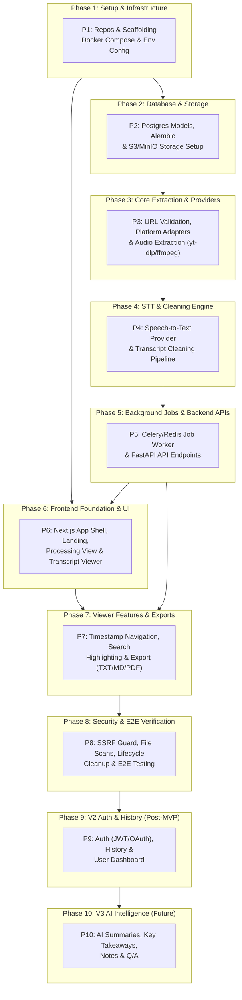

# Video2Content (VideoScribe) - Master Engineering Task Breakdown

This document outlines the atomic, phased, dependency-driven engineering tasks required to build the **Video2Content** platform based on the specifications detailed in [Prd.md](file:///c:/Users/user/Downloads/Learning/AI_Codebasics/Personal%20Project/VideoScribe/Prd.md).

---

## 1. High-Level Dependency Graph

---

## 2. Phased Task Breakdown

### Phase 1: Repository Setup, Tooling & Infrastructure Scaffolding
*Prerequisites: None*

- [x] **`TASK-1.1` Monorepo Scaffolding & Directory Structure**
  - **Component**: Infrastructure / Repo Root
  - **Prerequisites**: None
  - **Details**:
    - Initialize project directory structure as defined in Section 34 of the PRD (`frontend/`, `backend/`, `infrastructure/`, `tests/`, `docs/`).
    - Create `.gitignore`, `.editorconfig`, and root `README.md`.
    - Create root `.env.example` defining environment variables for Postgres, Redis, S3/MinIO, and API keys.
  - **Files**:
    - `backend/`, `frontend/`, `infrastructure/`, `tests/`, `docs/`
    - `.gitignore`, `.env.example`, `README.md`
  - **Acceptance Criteria**: Folder tree matches PRD Section 34; git ignores python virtualenvs, node_modules, temp media, and secrets.

- [x] **`TASK-1.2` Local Development Containerization (Docker Compose)**
  - **Component**: Infrastructure
  - **Prerequisites**: `TASK-1.1`
  - **Details**:
    - Configure `docker-compose.yml` with services:
      - `postgres` (PostgreSQL 16 with healthcheck).
      - `redis` (Redis 7 for Celery broker & result backend).
      - `minio` (Local S3-compatible object storage with default bucket `video2content-media`).
      - `backend` (FastAPI hot-reload service container).
      - `worker` (Celery worker container with ffmpeg installed).
      - `frontend` (Next.js development container).
  - **Files**:
    - `docker-compose.yml`
    - `infrastructure/docker/backend.Dockerfile`
    - `infrastructure/docker/frontend.Dockerfile`
  - **Acceptance Criteria**: Running `docker compose up -d` brings up all services; Postgres, Redis, and MinIO pass health checks.

- [x] **`TASK-1.3` Backend Python Environment & Base Config**
  - **Component**: Backend Core
  - **Prerequisites**: `TASK-1.1`
  - **Details**:
    - Initialize Python 3.11+ environment with `pyproject.toml` or `requirements.txt`.
    - Install dependencies: `fastapi`, `uvicorn[standard]`, `pydantic`, `pydantic-settings`, `sqlalchemy`, `alembic`, `psycopg2-binary` or `asyncpg`, `celery`, `redis`, `boto3`, `yt-dlp`, `youtube-transcript-api`, `pytest`.
    - Implement `backend/app/config.py` using `pydantic-settings` to parse and validate environment variables with typed defaults.
  - **Files**:
    - `backend/pyproject.toml` or `backend/requirements.txt`
    - `backend/app/config.py`
    - `backend/app/__init__.py`
  - **Acceptance Criteria**: Configuration loads cleanly from `.env`; missing mandatory vars raise descriptive validation errors on startup.

- [x] **`TASK-1.4` Frontend Next.js Project Initialization**
  - **Component**: Frontend Core
  - **Prerequisites**: `TASK-1.1`
  - **Details**:
    - Initialize Next.js 14+ (App Router) with TypeScript.
    - Set up base CSS with modern design tokens (color palettes, typography from Google Fonts, dark mode support, glassmorphism tokens).
    - Install Lucide icons (`lucide-react`), utility classes (`clsx`, `tailwind-merge` if using Tailwind or standard CSS modules).
  - **Files**:
    - `frontend/package.json`
    - `frontend/tsconfig.json`
    - `frontend/app/layout.tsx`
    - `frontend/app/globals.css`
  - **Acceptance Criteria**: Frontend starts with `npm run dev` and renders the root page without console errors.

---

### Phase 2: Database Schema, ORM Models & Storage Layer
*Prerequisites: Phase 1 (`TASK-1.2`, `TASK-1.3`)*

- [x] **`TASK-2.1` Database Connection & Alembic Migration Harness**
  - **Component**: Backend / Database
  - **Prerequisites**: `TASK-1.3`
  - **Details**:
    - Configure SQLAlchemy database session management (`backend/app/db/session.py`) with connection pooling and context-managed sessions.
    - Initialize Alembic (`alembic init backend/alembic`).
    - Configure `alembic/env.py` to read SQLAlchemy declarative models and database URL from `config.py`.
  - **Files**:
    - `backend/app/db/session.py`
    - `backend/app/db/base.py`
    - `backend/alembic.ini`
    - `backend/alembic/env.py`
  - **Acceptance Criteria**: `alembic upgrade head` executes successfully against PostgreSQL container.

- [x] **`TASK-2.2` SQLAlchemy ORM Data Models**
  - **Component**: Backend / Database
  - **Prerequisites**: `TASK-2.1`
  - **Details**:
    - Create ORM models matching PRD Section 20:
      - `User`: `id` (UUID), `email`, `name`, `created_at`.
      - `Video`: `id` (UUID), `user_id` (FK nullable for anonymous), `source_url`, `platform` (ENUM: `youtube`, `upload`, `vimeo`, etc.), `title`, `duration` (integer seconds), `language` (VARCHAR(10)), `status` (ENUM: `pending`, `processing`, `completed`, `failed`), `created_at`.
      - `Transcript`: `id` (UUID), `video_id` (FK, unique), `raw_text` (TEXT), `clean_text` (TEXT), `language`, `created_at`.
      - `TranscriptSegment`: `id` (UUID), `transcript_id` (FK), `start_time` (FLOAT), `end_time` (FLOAT), `text` (TEXT), `speaker` (VARCHAR, nullable).
      - `TranscriptionJob`: `id` (UUID/string), `video_id` (FK), `status` (ENUM: `queued`, `detecting`, `extracting`, `transcribing`, `cleaning`, `completed`, `failed`), `progress` (INTEGER 0-100), `error_message` (TEXT nullable), `created_at`, `updated_at`.
      - `ProcessingError`: `id` (UUID), `job_id` (FK nullable), `error_code`, `message`, `stack_trace`, `created_at`.
    - Generate initial Alembic migration script.
  - **Files**:
    - `backend/app/models/user.py`
    - `backend/app/models/video.py`
    - `backend/app/models/transcript.py`
    - `backend/app/models/job.py`
    - `backend/app/models/error.py`
    - `backend/app/models/__init__.py`
    - `backend/alembic/versions/0001_initial_schema.py`
  - **Acceptance Criteria**: All tables, foreign keys, indexes on `video_id`, `transcript_id`, `job_id` created via migration.

- [x] **`TASK-2.3` Object Storage Client (S3 / MinIO Client)**
  - **Component**: Backend / Storage
  - **Prerequisites**: `TASK-1.3`
  - **Details**:
    - Create `backend/app/services/storage.py` encapsulating `boto3` client operations:
      - `upload_file(file_obj, destination_key, content_type)`
      - `generate_presigned_upload_url(key, content_type, expires_in=3600)`
      - `generate_presigned_download_url(key, expires_in=3600)`
      - `delete_file(key)`
      - `delete_temp_media_older_than(hours=24)`
    - Ensure MinIO endpoint URL override works for local development vs AWS S3 in production.
  - **Files**:
    - `backend/app/services/storage.py`
    - `backend/tests/test_storage.py`
  - **Acceptance Criteria**: Unit/integration tests verify file upload, presigned URL generation, and deletion against local MinIO.

---

### Phase 3: Ingestion, Provider Architecture & Audio Extraction
*Prerequisites: Phase 1 & 2 (`TASK-1.3`, `TASK-2.3`)*

- [x] **`TASK-3.1` URL Validator & Platform Detection Engine**
  - **Component**: Backend / Ingestion
  - **Prerequisites**: `TASK-1.3`
  - **Details**:
    - Implement `backend/app/services/url_validator.py`:
      - Validate URL structure using strict regex & `urllib.parse`.
      - Check for malicious URLs, loopback/private IP addresses (SSRF prevention against `127.0.0.1`, `10.0.0.0/8`, `169.254.169.254`, etc.).
    - Implement `backend/app/providers/platform_detector.py`:
      - Identify platform: YouTube (`youtube.com`, `youtu.be`), Vimeo, or Generic Direct URL.
      - Extract standard canonical video ID (e.g. YouTube 11-char ID).
  - **Files**:
    - `backend/app/services/url_validator.py`
    - `backend/app/providers/platform_detector.py`
    - `backend/tests/test_platform_detector.py`
  - **Acceptance Criteria**: Unit tests cover regular URLs, short links, mobile URLs, playlist parameters, and invalid/SSRF target URLs.

- [x] **`TASK-3.2` Platform Provider Interface & YouTube Caption Provider**
  - **Component**: Backend / Providers
  - **Prerequisites**: `TASK-3.1`
  - **Details**:
    - Define abstract base class `BasePlatformAdapter` (`backend/app/providers/base.py`) with methods:
      - `get_metadata(url: str) -> VideoMetadata` (title, duration, language, thumbnail)
      - `has_captions(url: str) -> bool`
      - `extract_captions(url: str, preferred_languages: list[str]) -> list[RawCaptionSegment] | None`
    - Implement `YouTubeAdapter` (`backend/app/providers/youtube.py`):
      - Use `youtube-transcript-api` and fallback to `yt-dlp` subtitle extraction.
      - Fetch manual subtitles first; fallback to auto-generated captions if manual not available.
      - Fetch video metadata (title, duration in seconds, author).
  - **Files**:
    - `backend/app/providers/base.py`
    - `backend/app/providers/youtube.py`
    - `backend/app/schemas/provider.py`
    - `backend/tests/test_youtube_provider.py`
  - **Acceptance Criteria**: For public YouTube videos with captions, retrieves segments with `start`, `duration`, and raw text without invoking audio extraction.

- [x] **`TASK-3.3` Audio Extraction Service (`ffmpeg` & `yt-dlp`)**
  - **Component**: Backend / Audio Processing
  - **Prerequisites**: `TASK-1.3`, `TASK-2.3`
  - **Details**:
    - Implement `backend/app/services/audio_extractor.py`:
      - For remote URLs without captions: use `yt-dlp` to extract single audio stream into 16kHz mono MP3 or WAV (optimized for STT).
      - For user-uploaded video files: use `ffmpeg` to extract audio stream (`ffmpeg -i input.mp4 -vn -acodec libmp3lame -ar 16000 -ac 1 output.mp3`).
      - Include timeout controls and file size limits (max 500MB / 2-hour audio limit).
      - Ensure intermediate temp files are safely written to a dedicated scratch directory and cleaned up via context managers or `try...finally`.
  - **Files**:
    - `backend/app/services/audio_extractor.py`
    - `backend/tests/test_audio_extractor.py`
  - **Acceptance Criteria**: Converts sample MP4/MKV and YouTube audio streams to 16kHz mono audio files and removes temp video on exit.

---

### Phase 4: Speech-to-Text (STT) Abstraction & Transcription Engine
*Prerequisites: Phase 3 (`TASK-3.3`)*

- [x] **`TASK-4.1` Speech-to-Text Provider Interface & Implementations**
  - **Component**: Backend / STT
  - **Prerequisites**: `TASK-1.3`, `TASK-3.3`
  - **Details**:
    - Define abstract base class `BaseSTTProvider` (`backend/app/providers/stt/base.py`):
      - `transcribe(audio_file_path: str, language: str | None = None) -> STTResult` (contains full text, segments with start/end timestamps, detected language, confidence score).
    - Implement `WhisperSTTProvider` (`backend/app/providers/stt/whisper_provider.py`):
      - Support OpenAI Whisper API or local `faster-whisper` based on configuration flag `STT_PROVIDER=openai|faster_whisper|mock`.
    - Implement `MockSTTProvider` for unit tests and local dev without consuming API credits.
  - **Files**:
    - `backend/app/providers/stt/base.py`
    - `backend/app/providers/stt/whisper_provider.py`
    - `backend/app/providers/stt/mock_provider.py`
    - `backend/app/providers/stt/__init__.py`
    - `backend/tests/test_stt_provider.py`
  - **Acceptance Criteria**: Mock and Whisper adapters adhere to the interface, returning standardized segment lists `[{start: float, end: float, text: str}]`.

- [x] **`TASK-4.2` Fallback & Cost-Optimization Decision Pipeline**
  - **Component**: Backend / Core Logic
  - **Prerequisites**: `TASK-3.2`, `TASK-4.1`
  - **Details**:
    - Implement decision engine (`backend/app/services/transcription_router.py`):
      - **Step 1**: If source is a supported URL, check for available captions/transcripts.
      - **Step 2**: If captions found, use caption provider (Zero STT cost).
      - **Step 3**: If captions unavailable or source is an uploaded video, verify media access, extract audio, and route to STT provider.
      - **Step 4**: Return standardized intermediate transcription payload.
  - **Files**:
    - `backend/app/services/transcription_router.py`
    - `backend/tests/test_transcription_router.py`
  - **Acceptance Criteria**: Public video with captions bypasses audio extraction & STT; video without captions or direct upload triggers STT fallback.

---

### Phase 5: Transcript Processing, Cleaning & Normalization Pipeline
*Prerequisites: Phase 4 (`TASK-4.2`)*

- [x] **`TASK-5.1` Text Cleaning & Formatting Normalizer**
  - **Component**: Backend / Text Processing
  - **Prerequisites**: `TASK-1.3`
  - **Details**:
    - Implement `backend/app/services/transcript_cleaner.py` per PRD Section 9:
      - Remove duplicate caption fragments and repeated overlapping subtitle lines common in auto-captions.
      - Remove unnecessary line breaks within sentences.
      - Merge broken sentence clauses into cohesive sentences based on punctuation and pauses.
      - Group sentences into logical paragraphs (using natural semantic pauses or 3-5 sentence chunks).
      - Remove filler artifacts/caption noise (e.g. `[Applause]`, `[Music]`, `>>`, `um`, `uh` where appropriate).
      - Preserve technical terminology, acronyms, and numeric entities.
      - Ensure original wording and meaning are preserved (NO generative re-writing in default mode).
  - **Files**:
    - `backend/app/services/transcript_cleaner.py`
    - `backend/tests/test_transcript_cleaner.py`
  - **Acceptance Criteria**: Cleans noisy raw caption chunks into coherent paragraphs with correct capitalization and punctuation; preserves all technical terms.

- [x] **`TASK-5.2` Timestamp & Segment Alignment Engine**
  - **Component**: Backend / Text Processing
  - **Prerequisites**: `TASK-5.1`
  - **Details**:
    - Implement `backend/app/services/segment_aligner.py`:
      - Align cleaned sentences and paragraphs with their respective timestamp intervals (`start_time`, `end_time`).
      - Build both output representations:
        1. **Reading Mode Text**: Cohesive, continuous paragraphs without inline timestamp clutter.
        2. **Timestamp Mode Segments**: Grouped timestamp blocks (e.g., every 30-60 seconds or per paragraph/speaker switch) with formatted string `HH:MM:SS`.
  - **Files**:
    - `backend/app/services/segment_aligner.py`
    - `backend/app/schemas/transcript.py`
    - `backend/tests/test_segment_aligner.py`
  - **Acceptance Criteria**: Generated `clean_text` and `segments` list are synchronized; each segment has valid float timestamps and formatted string.

---

### Phase 6: Asynchronous Job Orchestration & Worker Infrastructure
*Prerequisites: Phase 2, 3, 4, 5 (`TASK-2.2`, `TASK-3.3`, `TASK-4.2`, `TASK-5.2`)*

- [x] **`TASK-6.1` Celery Worker Setup & Task Configuration**
  - **Component**: Backend / Worker
  - **Prerequisites**: `TASK-1.3`, `TASK-2.1`
  - **Details**:
    - Configure Celery app (`backend/app/workers/celery_app.py`) with Redis broker & backend.
    - Set up concurrency, task time limits (e.g., max 15 minutes per task), and JSON serialization.
    - Define task state progress tracker helper (`update_job_progress(job_id, status, progress_pct)`).
  - **Files**:
    - `backend/app/workers/celery_app.py`
    - `backend/app/workers/job_tracker.py`
  - **Acceptance Criteria**: Celery worker starts up and connects to Redis; job tracker updates `TranscriptionJob` table in PostgreSQL.

- [x] **`TASK-6.2` End-to-End Transcription Pipeline Celery Task**
  - **Component**: Backend / Worker
  - **Prerequisites**: `TASK-6.1`, `TASK-4.2`, `TASK-5.2`
  - **Details**:
    - Implement Celery task `process_video_job(job_id: str)` in `backend/app/workers/tasks.py`:
      - State 1: `detecting` (10%) -> Validate URL, detect platform, fetch video metadata.
      - State 2: `extracting` (30%) -> Fetch captions or download/extract audio stream.
      - State 3: `transcribing` (60%) -> Run STT if captions unavailable.
      - State 4: `cleaning` (85%) -> Clean text, normalize paragraphs, align timestamps.
      - State 5: `completed` (100%) -> Save `Transcript` & `TranscriptSegment` records, update `Video` status.
      - State Error: `failed` -> Log error in `ProcessingError`, record human-friendly error message in `TranscriptionJob`.
      - Ensure all temporary audio/video files on disk are deleted upon completion or failure.
  - **Files**:
    - `backend/app/workers/tasks.py`
    - `backend/tests/test_worker_tasks.py`
  - **Acceptance Criteria**: Triggering `process_video_job` progresses through states and saves clean transcript into database.

---

### Phase 7: FastAPI Backend API Layer & Endpoints
*Prerequisites: Phase 2, 6 (`TASK-2.2`, `TASK-6.2`)*

- [x] **`TASK-7.1` Pydantic Schemas & DTO Layer**
  - **Component**: Backend / API
  - **Prerequisites**: `TASK-1.3`
  - **Details**:
    - Implement Pydantic models for request/response validation (`backend/app/schemas/`):
      - `VideoSubmitRequest`: `url` (HttpUrl)
      - `JobResponse`: `job_id`, `status`, `progress`, `error_message`, `created_at`
      - `TranscriptSegmentResponse`: `id`, `start_time`, `end_time`, `timestamp_label`, `text`, `speaker`
      - `TranscriptResponse`: `id`, `video_id`, `title`, `source_url`, `platform`, `duration`, `duration_formatted`, `language`, `raw_text`, `clean_text`, `segments`
      - `UploadInitiateResponse`: `job_id`, `upload_url`, `s3_key`
  - **Files**:
    - `backend/app/schemas/api.py`
    - `backend/app/schemas/transcript.py`
    - `backend/app/schemas/job.py`
  - **Acceptance Criteria**: Pydantic schemas validate inputs and serialize JSON responses with exact field types.

- [x] **`TASK-7.2` Core API Endpoints Implementation**
  - **Component**: Backend / API
  - **Prerequisites**: `TASK-7.1`, `TASK-6.2`
  - **Details**:
    - Implement FastAPI routers (`backend/app/api/v1/`):
      - `POST /api/v1/videos`: Accepts video URL, validates URL, creates `Video` and `TranscriptionJob`, enqueues Celery task, returns `job_id` and `queued` status (PRD Section 19).
      - `POST /api/v1/uploads`: Accepts direct file upload (or generates presigned S3 upload URL), creates `Video` and `TranscriptionJob`, enqueues Celery task (PRD Section 19).
      - `GET /api/v1/jobs/{job_id}`: Returns current processing status, progress percentage, step descriptions, or error details (PRD Section 19).
      - `GET /api/v1/transcripts/{id}`: Returns complete transcript metadata, cleaned text, and timestamped segments (PRD Section 19).
      - `GET /api/v1/health`: Returns API, DB, and Redis health status.
    - Set up CORS middleware for frontend domain.
  - **Files**:
    - `backend/app/main.py`
    - `backend/app/api/v1/videos.py`
    - `backend/app/api/v1/uploads.py`
    - `backend/app/api/v1/jobs.py`
    - `backend/app/api/v1/transcripts.py`
    - `backend/app/api/v1/health.py`
    - `backend/tests/test_api_endpoints.py`
  - **Acceptance Criteria**: Automated test suite covers all endpoints; status codes 200, 202, 400, 404, 422, 500 return accurate payloads.

- [x] **`TASK-7.3` User-Friendly Error Formatting & Middleware**
  - **Component**: Backend / API
  - **Prerequisites**: `TASK-7.2`
  - **Details**:
    - Implement custom exception classes and global exception handlers per PRD Section 15:
      - `InvalidUrlException` -> "We couldn't recognize this video URL. Please check the URL and try again."
      - `UnsupportedPlatformException` -> "This platform isn't currently supported. Try uploading the video instead."
      - `CaptionsUnavailableException` -> "Captions aren't available for this video. If you own or can upload the video, upload it here to generate a transcript."
      - `PrivateVideoException` -> "We can't access this private video. Please provide an accessible video or upload the file."
      - `ProcessingFailureException` -> "We couldn't process this video. Please try again or upload the video directly."
  - **Files**:
    - `backend/app/core/exceptions.py`
    - `backend/app/core/error_handlers.py`
  - **Acceptance Criteria**: API returns structured JSON error responses with user-facing messages matching PRD specifications.

---

### Phase 8: Next.js Frontend Core Architecture & State Management
*Prerequisites: Phase 1, 7 (`TASK-1.4`, `TASK-7.2`)*

- [x] **`TASK-8.1` API Client Service & Data Fetching Hooks**
  - **Component**: Frontend / Services
  - **Prerequisites**: `TASK-1.4`
  - **Details**:
    - Implement type-safe HTTP client (`frontend/services/api.ts`) using `fetch` or `axios`.
    - Implement methods:
      - `submitVideoUrl(url: string): Promise<{ jobId: string }>`
      - `uploadVideoFile(file: File, onProgress?: (pct: number) => void): Promise<{ jobId: string }>`
      - `getJobStatus(jobId: string): Promise<JobStatusResponse>`
      - `getTranscript(transcriptId: string): Promise<TranscriptResponse>`
    - Create polling hook `useJobStatus(jobId: string)` that polls `/api/v1/jobs/{jobId}` every 1.5s until terminal state (`completed` or `failed`).
  - **Files**:
    - `frontend/services/api.ts`
    - `frontend/hooks/useJobStatus.ts`
    - `frontend/types/api.ts`
  - **Acceptance Criteria**: Types strictly match backend schemas; polling hook handles retry, exponential backoff, and error termination.

- [x] **`TASK-8.2` UI Design System & Component Library**
  - **Component**: Frontend / UI
  - **Prerequisites**: `TASK-1.4`
  - **Details**:
    - Create reusable, accessible UI components with rich aesthetics (dark mode, glassmorphism, fluid micro-interactions):
      - `Button`: Primary, Secondary, Ghost, Outline, with loading spinners.
      - `Input`: URL input field with clear button, validation state, paste helper.
      - `Card` / `GlassPanel`: Framed containers with frosted glass styling.
      - `ProgressBar`: Animated progress bar with smooth CSS transitions.
      - `Badge`: Status badges (`Queued`, `Processing`, `Completed`, `Failed`).
      - `Modal` / `Dialog`: Accessible dialogs.
      - `Tabs`: Mode switcher (e.g. Reading Mode vs Timestamp Mode).
  - **Files**:
    - `frontend/components/ui/button.tsx`
    - `frontend/components/ui/input.tsx`
    - `frontend/components/ui/card.tsx`
    - `frontend/components/ui/progress-bar.tsx`
    - `frontend/components/ui/badge.tsx`
    - `frontend/components/ui/tabs.tsx`
  - **Acceptance Criteria**: Components render cleanly, support keyboard navigation, and adhere to a unified aesthetic design.

---

### Phase 9: Frontend UI Pages & Interactive Views
*Prerequisites: Phase 8 (`TASK-8.1`, `TASK-8.2`)*

- [x] **`TASK-9.1` Landing Page & Input Form (URL + File Upload)**
  - **Component**: Frontend / Pages
  - **Prerequisites**: `TASK-8.2`
  - **Details**:
    - Implement landing page (`frontend/app/page.tsx`) matching PRD Section 7 & Section 16:
      - Clean hero title: "Turn Videos Into Text".
      - Subtitle: "Paste a video link or upload a video file to extract clean, readable spoken content."
      - Primary URL Input box with auto-focus and "Get Content" action button.
      - "OR" divider.
      - Drag-and-drop file upload zone supporting `.mp4`, `.mov`, `.webm`, `.mkv`, `.mp3`, `.wav`, `.m4a` (max 500MB).
      - Instant client-side validation for empty inputs and unsupported file extensions.
  - **Files**:
    - `frontend/app/page.tsx`
    - `frontend/components/landing/UrlInputForm.tsx`
    - `frontend/components/landing/FileUploadDropzone.tsx`
  - **Acceptance Criteria**: Pasting a URL or dropping a video file triggers submission and redirects to the processing view.

- [x] **`TASK-9.2` Processing & Progress Screen**
  - **Component**: Frontend / Pages
  - **Prerequisites**: `TASK-8.1`, `TASK-9.1`
  - **Details**:
    - Implement processing view (`frontend/app/process/[jobId]/page.tsx`) matching PRD Section 26:
      - Display animated circular/linear progress bar with numeric percentage (0-100%).
      - Display real-time step checklist:
        - `✓ Video detected`
        - `✓ Audio extracted`
        - `✓ Transcription completed`
        - `● Cleaning transcript`
      - Display friendly error state with retry and upload fallback options if job fails.
      - Automatically route to `/transcript/[id]` upon completion.
  - **Files**:
    - `frontend/app/process/[jobId]/page.tsx`
    - `frontend/components/processing/StepChecklist.tsx`
    - `frontend/components/processing/ProcessingErrorView.tsx`
  - **Acceptance Criteria**: Shows step-by-step transition as backend progress updates; automatically transitions to transcript page when done.

- [x] **`TASK-9.3` Transcript Viewer Screen Layout & Metadata Header**
  - **Component**: Frontend / Pages
  - **Prerequisites**: `TASK-8.2`
  - **Details**:
    - Implement transcript output page (`frontend/app/transcript/[id]/page.tsx`) matching PRD Section 10:
      - **Header**: Video Title, Source platform badge (e.g. YouTube), Duration (formatted `HH:MM:SS`), Language badge, Source link.
      - **Action Toolbar**: Copy button, Download TXT button, Download Markdown button, View Mode switcher.
      - **Main Content Area**: Responsive container with typography optimized for reading.
  - **Files**:
    - `frontend/app/transcript/[id]/page.tsx`
    - `frontend/components/transcript/TranscriptHeader.tsx`
    - `frontend/components/transcript/TranscriptActions.tsx`
  - **Acceptance Criteria**: Displays video metadata and provides structured containers for the transcript modes.

---

### Phase 10: Transcript Core Features (Reading, Timestamps, Search & Export)
*Prerequisites: Phase 9 (`TASK-9.3`)*

- [x] **`TASK-10.1` Dual View Modes (Reading Mode vs Timestamp Mode)**
  - **Component**: Frontend / Transcript Viewer
  - **Prerequisites**: `TASK-9.3`
  - **Details**:
    - Implement `ReadingModeView.tsx` (PRD Section 11):
      - Formats cleaned paragraphs with comfortable line-height and typography.
      - Eliminates all timestamp clutter for uninterrupted reading.
    - Implement `TimestampModeView.tsx` (PRD Section 11):
      - Displays timestamp badges alongside respective text blocks.
      - Clicking a timestamp opens the source video at that exact time (e.g. `youtube.com/watch?v=xxx&t=123s`) in a modal or new tab.
      - Seamless toggle switch between the two modes with state persisted in local storage or URL query param.
  - **Files**:
    - `frontend/components/transcript/ReadingModeView.tsx`
    - `frontend/components/transcript/TimestampModeView.tsx`
    - `frontend/components/transcript/ModeSwitcher.tsx`
  - **Acceptance Criteria**: Toggle switches between clean paragraphs and interactive timestamp blocks without re-fetching data.

- [x] **`TASK-10.2` In-Transcript Search & Keyword Highlighting**
  - **Component**: Frontend / Transcript Viewer
  - **Prerequisites**: `TASK-10.1`
  - **Details**:
    - Implement in-page search bar matching PRD Section 12:
      - Search input with debounce (200ms) and clear button.
      - Match counter: e.g. "12 matches found".
      - "Next" (`↓`) and "Previous" (`↑`) navigation controls.
      - Highlight matching text across paragraphs and timestamp segments using `<mark>` elements.
      - Auto-scroll to the active matching segment.
  - **Files**:
    - `frontend/components/transcript/TranscriptSearch.tsx`
    - `frontend/hooks/useTranscriptSearch.ts`
  - **Acceptance Criteria**: Searching highlights all occurrences, updates count, and keyboard `Enter`/`Shift+Enter` navigates between occurrences.

- [x] **`TASK-10.3` Copy to Clipboard & TXT / Markdown Export Engine**
  - **Component**: Frontend / Actions
  - **Prerequisites**: `TASK-9.3`
  - **Details**:
    - Implement export utilities (`frontend/utils/export.ts`):
      - `copyTranscript(text: string)`: Copies text to clipboard with animated toast confirmation ("Copied to clipboard!").
      - `downloadTxtFile(title: string, content: string)`: Downloads formatted `.txt` file with header metadata.
      - `downloadMarkdownFile(title: string, metadata: object, content: string)`: Downloads structured `.md` file with frontmatter and markdown headings.
      - `downloadPdfFile(title: string, content: string)`: Client-side printable PDF export or print stylesheet.
  - **Files**:
    - `frontend/utils/export.ts`
    - `frontend/components/ui/toast.tsx`
    - `frontend/components/transcript/ExportDropdown.tsx`
  - **Acceptance Criteria**: Copying copies text cleanly; download buttons trigger instantaneous browser file downloads with sanitized filenames.

---

### Phase 11: Security, Storage Lifecycle & Cost Control
*Prerequisites: Phase 6, 7 (`TASK-6.2`, `TASK-7.2`)*

- [x] **`TASK-11.1` SSRF Protection & URL Sanitization Guard**
  - **Component**: Backend / Security
  - **Prerequisites**: `TASK-3.1`
  - **Details**:
    - Harden URL resolution (`backend/app/security/ssrf_guard.py`):
      - Resolve DNS hostname before requesting to verify the target IP is not in private/reserved CIDR blocks (`10.0.0.0/8`, `172.16.0.0/12`, `192.168.0.0/16`, `127.0.0.0/8`, `169.254.0.0/16`, `::1/128`, `fc00::/7`).
      - Block requests to AWS metadata IP (`169.254.169.254`).
      - Enforce allowed protocols (`http`, `https` only).
  - **Files**:
    - `backend/app/security/ssrf_guard.py`
    - `backend/tests/test_ssrf_guard.py`
  - **Acceptance Criteria**: Requests to internal network addresses or metadata endpoints are blocked with 400 Bad Request.

- [x] **`TASK-11.2` Upload Sanitization, File Size Limits & Rate Limiting**
  - **Component**: Backend / Security
  - **Prerequisites**: `TASK-7.2`
  - **Details**:
    - Validate file MIME types using magic bytes (`python-magic`), not just extension.
    - Enforce 500MB maximum upload limit at FastAPI and Nginx/reverse proxy level.
    - Implement IP-based rate limiting on `/api/v1/videos` and `/api/v1/uploads` using Redis (`slowapi` or custom Redis sliding window: max 10 submissions / hour for anonymous users).
  - **Files**:
    - `backend/app/security/file_validator.py`
    - `backend/app/security/rate_limiter.py`
    - `backend/tests/test_rate_limiter.py`
  - **Acceptance Criteria**: Uploading non-video files or exceeding rate limit returns 400/429 HTTP status codes.

- [x] **`TASK-11.3` Temporary Media Auto-Cleanup & S3 Lifecycle Management**
  - **Component**: Backend / Storage
  - **Prerequisites**: `TASK-2.3`, `TASK-6.2`
  - **Details**:
    - Implement S3 / MinIO bucket lifecycle configuration to expire objects in `temp-media/` after 24 hours.
    - Add Celery periodic task (`backend/app/workers/cleanup_tasks.py`) running hourly to purge any orphaned local temporary audio files in `/tmp/videoscribe/`.
  - **Files**:
    - `backend/app/workers/cleanup_tasks.py`
    - `infrastructure/aws/s3_lifecycle.json`
  - **Acceptance Criteria**: Completed and failed job media files are purged automatically from local disk and storage bucket.

---

### Phase 12: Automated Testing, E2E Integration & MVP Quality Verification
*Prerequisites: Phases 1 through 11*

- [x] **`TASK-12.1` Backend Unit & Integration Test Suite**
  - **Component**: Backend / Testing
  - **Prerequisites**: `TASK-7.2`, `TASK-6.2`
  - **Details**:
    - Build comprehensive Pytest suite:
      - Unit tests for `url_validator`, `platform_detector`, `transcript_cleaner`, `segment_aligner`.
      - Integration tests for FastAPI endpoints using `httpx.AsyncClient`.
      - Mocked worker tests for Celery task execution lifecycle.
  - **Files**:
    - `backend/tests/conftest.py`
    - `backend/tests/test_cleaner.py`
    - `backend/tests/test_api.py`
    - `backend/tests/test_pipeline.py`
  - **Acceptance Criteria**: `pytest backend/tests` passes with >85% code coverage.

- [x] **`TASK-12.2` Frontend Component & Integration Tests**
  - **Component**: Frontend / Testing
  - **Prerequisites**: `TASK-10.3`
  - **Details**:
    - Set up Jest / Vitest + React Testing Library.
    - Write tests for:
      - `UrlInputForm`: URL submission validation.
      - `FileUploadDropzone`: File drop, type rejection, and size limit checks.
      - `TranscriptSearch`: Match highlighting and navigation.
      - `ModeSwitcher`: Toggle between Reading and Timestamp modes.
  - **Files**:
    - `frontend/tests/UrlInputForm.test.tsx`
    - `frontend/tests/TranscriptSearch.test.tsx`
    - `frontend/tests/TranscriptViewer.test.tsx`
  - **Acceptance Criteria**: `npm run test` passes without errors.

- [x] **`TASK-12.3` End-to-End MVP Smoke Test & User Flow Verification**
  - **Component**: E2E Testing
  - **Prerequisites**: `TASK-12.1`, `TASK-12.2`
  - **Details**:
    - Verify complete flow (PRD Section 35):
      1. Paste YouTube URL with existing captions -> Fast caption extraction -> Clean transcript rendered -> Copy / TXT download.
      2. Paste YouTube URL without captions / upload video file -> Audio extracted -> STT transcription -> Clean transcript rendered -> Search keyword highlighted.
      3. Invalid URL / private video -> User-friendly error message rendered with action suggestion.
  - **Files**:
    - `tests/e2e/test_mvp_flow.py` or Playwright test script `tests/e2e/mvp.spec.ts`
  - **Acceptance Criteria**: Both automated E2E script and manual browser walkthrough complete all 3 scenarios seamlessly.

---

### Phase 13: Phase 2 (V2) Enhancements - Auth, History & Extended Exports
*Prerequisites: Phase 12 (MVP Completion)*

- [ ] **`TASK-13.1` User Authentication System (OAuth & Email/Password)**
  - **Component**: Backend & Frontend / Auth
  - **Prerequisites**: `TASK-12.3`
  - **Details**:
    - Implement JWT authentication & Google OAuth2 login in FastAPI (`backend/app/api/v1/auth.py`).
    - Store hashed passwords with `bcrypt` / `argon2`.
    - Implement NextAuth.js or custom AuthProvider in frontend (`frontend/context/AuthContext.tsx`).
    - Allow anonymous users to use the tool while enabling logged-in users to save history.
  - **Files**:
    - `backend/app/api/v1/auth.py`
    - `backend/app/security/auth.py`
    - `frontend/context/AuthContext.tsx`
    - `frontend/components/auth/LoginModal.tsx`
  - **Acceptance Criteria**: Users can register, log in with Google or Email, and maintain persistent authenticated sessions.

- [ ] **`TASK-13.2` "My Videos" Processing History Dashboard**
  - **Component**: Frontend & Backend / History
  - **Prerequisites**: `TASK-13.1`
  - **Details**:
    - Implement `GET /api/v1/history` returning paginated list of user's processed videos.
    - Implement `/history` page in Next.js matching PRD Section 25:
      - Table showing Video Title, Platform, Duration, Date Processed, Action buttons (View Transcript, Delete).
  - **Files**:
    - `backend/app/api/v1/history.py`
    - `frontend/app/history/page.tsx`
    - `frontend/components/history/HistoryTable.tsx`
  - **Acceptance Criteria**: Logged-in users see all past processed transcripts and can reopen them instantly without re-processing.

- [ ] **`TASK-13.3` Multi-Language Support (English, Hindi & Language Selector)**
  - **Component**: Backend & Frontend / Localization
  - **Prerequisites**: `TASK-12.3`
  - **Details**:
    - Support Hindi and English caption extraction and STT transcription per PRD Section 13.
    - Add language selector to landing page and transcript view.
    - Clean text normalizer adapted to preserve Hindi Devanagari script formatting.
  - **Files**:
    - `backend/app/services/transcript_cleaner.py`
    - `frontend/components/ui/LanguageSelector.tsx`
  - **Acceptance Criteria**: Successfully transcribes and cleans Hindi and English videos; UI correctly renders Devanagari script.

- [ ] **`TASK-13.4` Advanced PDF & Markdown Export Generation**
  - **Component**: Backend / Export
  - **Prerequisites**: `TASK-12.3`
  - **Details**:
    - Backend endpoints `GET /api/v1/transcripts/{id}/export/pdf` and `GET /api/v1/transcripts/{id}/export/markdown`.
    - Generate formatted PDFs with styled headers, timestamps, and page numbers using `WeasyPrint` or `ReportLab`.
  - **Files**:
    - `backend/app/services/pdf_generator.py`
    - `backend/app/api/v1/transcripts.py`
  - **Acceptance Criteria**: Downloaded PDF contains clean typography, margins, header metadata, and structured paragraphs.

---

### Phase 14: Phase 3 (V3) AI Intelligence Features (Structured Knowledge)
*Prerequisites: Phase 13 (V2 Completion)*

- [ ] **`TASK-14.1` AI Intelligence Extensible Provider Architecture**
  - **Component**: Backend / AI Services
  - **Prerequisites**: `TASK-13.2`
  - **Details**:
    - Implement modular AI interface `BaseAIService` (`backend/app/services/ai/base.py`) per PRD Section 14 & 30:
      - `generate_summary(clean_text: str) -> str`
      - `extract_key_takeaways(clean_text: str) -> list[str]`
      - `generate_study_notes(clean_text: str) -> str`
      - `answer_transcript_question(clean_text: str, question: str) -> str`
      - `detect_chapters(segments: list) -> list[Chapter]`
    - Implement LLM provider (OpenAI / Gemini / Anthropic) with streaming support.
  - **Files**:
    - `backend/app/services/ai/base.py`
    - `backend/app/services/ai/openai_service.py`
    - `backend/app/api/v1/ai.py`
  - **Acceptance Criteria**: AI endpoints return streaming summary, key takeaways, and answer contextual questions based exclusively on the transcript content.

- [ ] **`TASK-14.2` Frontend AI Insights & Q&A Interactive Panel**
  - **Component**: Frontend / AI UI
  - **Prerequisites**: `TASK-14.1`
  - **Details**:
    - Add AI Insights tab to transcript viewer:
      - Tabbed cards for "Summary", "Key Takeaways", and "Structured Notes".
      - "Ask Video" Q&A chat drawer where users can query "What did the speaker say about Snowflake?" and get answers linked to timestamps.
  - **Files**:
    - `frontend/components/transcript/ai/AiInsightsPanel.tsx`
    - `frontend/components/transcript/ai/AskVideoChat.tsx`
  - **Acceptance Criteria**: Users can toggle AI insights without obscuring the original transcript; answers cite timestamp links.

---

## 3. Critical Path & Implementation Sequencing

| Sequence | Phase | Core Milestone | Blocking Dependency |
|---|---|---|---|
| **M1** | Phase 1 & 2 | Scaffolding, Docker, Database Models, Storage | None |
| **M2** | Phase 3 & 4 | URL/Platform Adapters, Audio Extractor, STT Abstraction | M1 |
| **M3** | Phase 5 & 6 | Transcript Cleaning Pipeline & Celery Background Worker | M2 |
| **M4** | Phase 7 | FastAPI API Layer, Endpoints & Error System | M3 |
| **M5** | Phase 8 & 9 | Next.js Frontend Shell, Landing, Processing & Viewer Views | M4 |
| **M6** | Phase 10 | Reading/Timestamp Modes, Search Highlighting & Exports | M5 |
| **M7** | Phase 11 & 12 | Security Hardening, Cleanup Lifecycles & E2E Validation (**MVP Launch**) | M6 |
| **M8** | Phase 13 | User Auth, History Dashboard & Multi-language (**V2 Launch**) | M7 |
| **M9** | Phase 14 | AI Summarization, Study Notes & Video Q/A (**V3 Launch**) | M8 |

---

## 4. Task Status Summary

| Phase | Phase Name | Total Tasks | Completed | Pending |
|---|---|:---:|:---:|:---:|
| **Phase 1** | Setup & Infrastructure | 4 | 4 | 0 |
| **Phase 2** | Database & Storage | 3 | 3 | 0 |
| **Phase 3** | Ingestion & Audio Extraction | 3 | 3 | 0 |
| **Phase 4** | STT & Provider Abstraction | 2 | 2 | 0 |
| **Phase 5** | Transcript Processing & Cleaning | 2 | 2 | 0 |
| **Phase 6** | Asynchronous Job Worker | 2 | 2 | 0 |
| **Phase 7** | FastAPI Backend API | 3 | 3 | 0 |
| **Phase 8** | Frontend Core & Design System | 2 | 2 | 0 |
| **Phase 9** | Frontend Pages & Views | 3 | 3 | 0 |
| **Phase 10** | Transcript Viewer Core Features | 3 | 3 | 0 |
| **Phase 11** | Security, Lifecycle & Rate Limiting | 3 | 3 | 0 |
| **Phase 12** | Testing & E2E Verification | 3 | 3 | 0 |
| **Phase 13** | V2 Features (Auth, History, Multi-lang) | 4 | 0 | 4 |
| **Phase 14** | V3 AI Intelligence Features | 2 | 0 | 2 |
| **Total** | | **39** | **33** | **6** |
